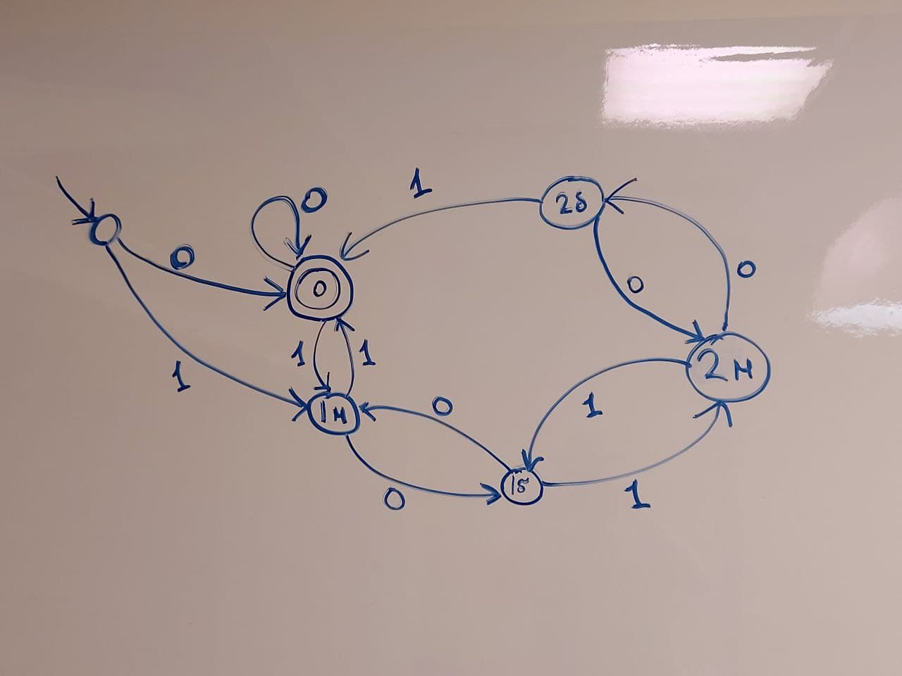

Признак делимости двоичного числа на 3: (кол-во единиц на четных позициях минус кол-во единиц на нечетных позициях) кратно 3(если считать по модулю 3, то имеем либо -1, либо 1 в сумме для каждой степени, знак зависит от степени). 
Построим автомат для этого языка:
  
Интуитивно понятно, как должна выглядеть регулярка для этого автомата - ```(0|1(01*0)*1)+```. Построим автомат по этой регулярке. Заметим, что он выглядит так же, как и автомат на рисунке, поэтома регулярка работает. 
