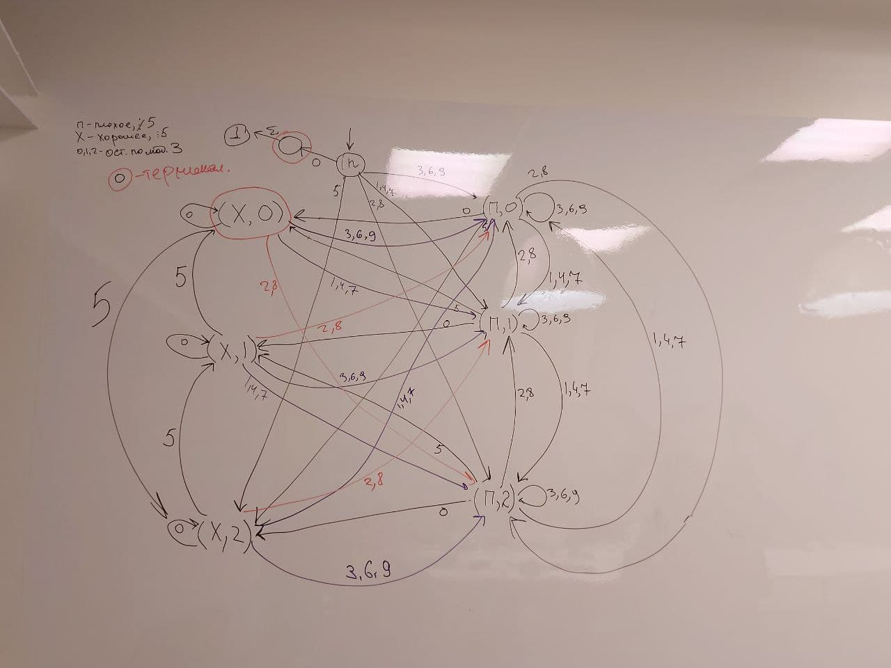

Разобьем 15 на простые множители: 15 = 3 * 5. Построим автомат для чисел, кратных трем и автомат, для чисел кратных 5, а потом найдем пересечение этих автоматов. Язык автомата - числа, кратные одновременно и трем, и пяти - равносильно кратности пятнадцати. 
 