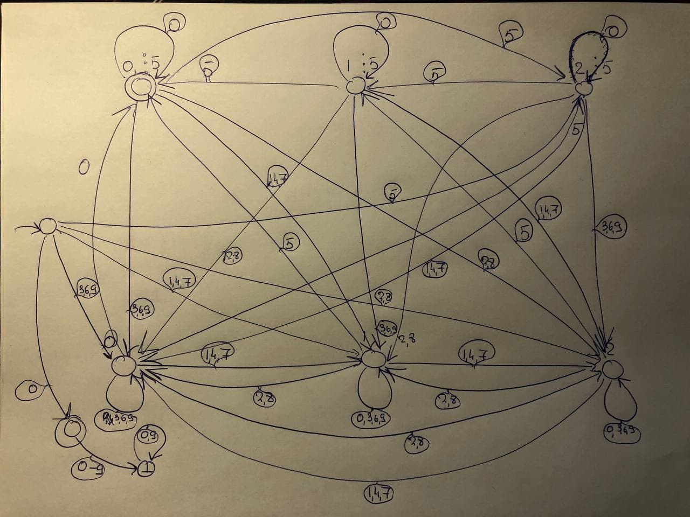

#### 1. Постройте регулярное выражение, распознающее числа в двоичной системе счисления, которые делятся на 3. Объясните, почему оно работает.

Сначала построим ДКА. Он основан на свойстве делимости разности (назову балансом) суммы цифр на четных позициях и суммы цифр на нечетных на 3. В терминальной вершине было что-то, что делилось на 3, добавили единицу и испортили баланс (разность больше не кратна 3), добавили единицу и вернули разности кратность 3. Если после единицы добавить 0, то баланс все еще испорчен (поменяли сумму нечетных с суммой четных), его нельзя починить просто добавляя 1, потому что они будут либо увеличивать сумму нечетных относительно четных, либо не менять испорченный баланс. Вновь пошли по 0, ничего в балансе не изменили, кроме порядка сумм. И только пройдя по 1, мы вернем баланс после порчи первой единицой, которой мы вошли в цикл. Крутилка по 0 не меняет баланс. 

Из ДКА легко построить регулярное выражение (0|1(0(1)\*0)\*1)* 

#### 2. Постройте детерминированный конечный автомат, распознающий числа в десятичной системе счисления, которые делятся на 15. Объясните, почему он работает.

Сначала я построила автомат, проверяющий числа на кратность 3, затем на кратность 5, написала их пересечение, минимизировала, по итогу получился граф как в кратности 3, но при этом есть вершина, в которую попадет число, если оно кратно 3 и кончается на 0 или 5 (то есть кратно 5). получился бык

#### 3. Предложите алгоритм проверки двух регулярных выражений на эквивалентность.

1. Построим по ним НКА
2. Минимизируем
3. Сравним автоматы на равенство:
а) Проверим, что языки совпадают, подставляя слова
б) Возьмем разности друг от друга, если получили автомат без терминальных вершин, то они одинаковы.
в) посмотрим и скажем что равенство очевидно из-за какой-нибудь биекции?

#### 4. Возьмите язык описания автоматов, который вы придумали в предыдущем задании, и напишите для него лексер, используя flex.

Немного изменила свой язык:
1. Для терминальных вершин ввела ключевое слово `Terminal`, после которого они перечисляются. Раньше терминальные вершины обозначались `(state_name)`. Сейчас я решила все вершины (кроме стартовой, за ней до сих пор закреплен символ `@`) писать в таком формате, благодаря чему могу однозначно разделить названия состояний и названия слов. Токен для состояний -- `STATE`
2. Слова были в кавычках. С появлением скобок у состояний, необходимость в кавычках отпала. Токен `WORD`
3. Токен `KEYWORD`, сейчас ключевых слова только два: `Sigma`, `Terminal`
4. Токен `EDGE` для символа перехода (ребра).
5. Для того, чтобы считать позицию в строке, создала глобальную переменную, которую пересчитываю в зависимости от длины прочитанного слова или переноса строки
6. Сейчас в лексере ошибка -- слово не соответсвующее никаким токенам и пробелам/табуляции/переносу строк.

Тесты 1, 2 выдают корректные символы
Тесты 3, 4 должны выдавать ошибку о некорректных символах

Дальше можно добавить проверку, что используются слова только из Сигмы, порядок символов в описании перехода верный, порядок объявления Сигмы и Терминальных вершин верный. (но я думала, что это задача парсера)

