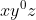
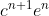
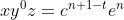
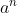

# Домашнее задание 3

## Задание 1

* Покажем, что язык нерегулярный, пользуясь леммой о накачке. Рассмотрим строку из нашего языка .
  Тогда разбивая слово на 3 части:  `= xyz`, получим в качестве `y` непустую подстроку из
  букв `'a'`. Но тогда слово  не лежит в нашем языке, т.к. `|u|!=|v|`, т.е. он нерегулярный.

* Покажем, что язык нерегулярный, пользуясь леммой о накачке. Рассмотрим строку из нашего языка .
  Тогда разбивая слово на 3 части:  `= xyz`, получим в качестве `y` непустую подстроку из
  букв `'c'`. Но тогда слово  не лежит в нашем языке, т.к. `n+1-t!=n+1` (`t!=0`), т.е. он
  нерегулярный.

* Покажем, что этот язык - регулярный. Если число пар таких простых чисел бесконечно, то для любой длины `n`, у нас
  будет слово , т.е. язык можно задать регулярным выражением `a*`. Если же число пар простых
  конечно, то наш язык - тоже конечен, т.е. он - регулярный.

## Задание 2

В файлах `regexps.py` и `fast_regexps.py` находятся реализации парсинга с помощью производных (во втором с
оптимизациями). Примеры построения регулярных выражений можно найти в наборах тестов `regexp_tests.py`
и `fast_regexp_tests.py`
соответственно. Чтобы протестировать реализацию, нужно запустить:

```shell
    $ python -m unittest regexp_tests
```

Или чтобы узнать время работы на тестах по отдельности

```shell
    $ pytest --durations=0 regexp_tests.py
```

Наборы тестов идентичны (по 120 случаев). Сделано по 5 запусков.

Среднее время работы простой реализации на всех тестах: 47.7942 s

Среднее время работы оптимизированной реализации на всех тестах: 0.009 s

Можно заметить многократный прирост производительности.

Также в файле `fast_regexps.py` есть тест `BadCase`, со строкой длины 40, на котором время работы оптимизированной
программы в среднем больше 5 секунд. Это происходит, потому что во время парсинга, при взятии производной, очень много
звездочек в нашем выражении разворачиваются в большую конкатенацию.