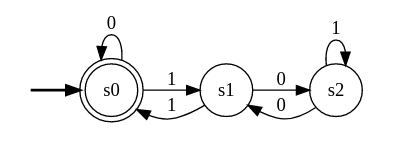
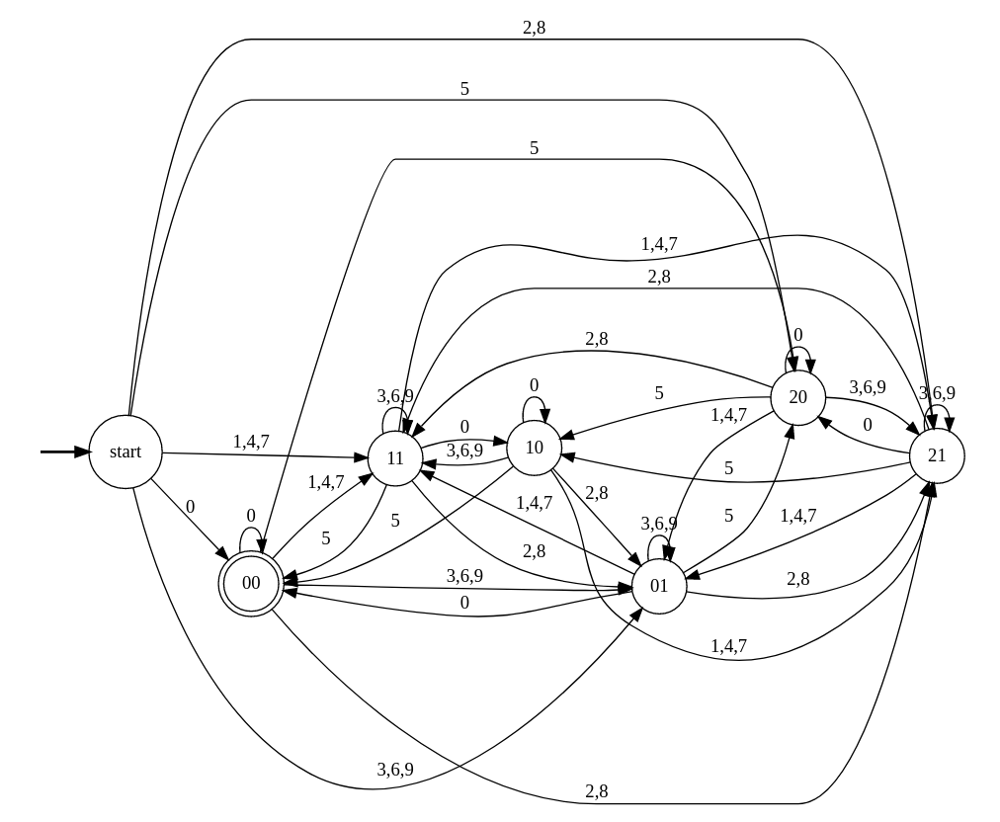

# Домашнее задание 2

## Задание №1

Пользуясь арифметикой остатков построим конечный автомат для подходящих нам двоичных строк.

Из него видно, что, чтобы попасть в терминальное состояние нужно пройти по циклу в полученном графе (хотя бы 1 раз, т.к.
строка непустая). Для этого есть несколько способов: ходить из `s0` в него само же или пойти в `s1`, откуда потом надо
будет вернуться. Цикл через `s1` также можно дополнить, пойдя в `s2` (в котором также можно зациклиться) и вернувшись из
него. Это дает нам следующее регулярное выражение: `(0|1(01*0)*1)+`

## Задание №2

В данном автомате: первая цифра в названии состояния - остаток от деления считанного числа на 3, второе - 0, если
последняя цифра числа 0 или 5 (т.е. делится ли считанное число на 5, по признаку делимости), и 1 в противном случае.

Тогда очевидно терминальным состоянием является `00` (т.к. только в нем считанное число делится и на 3, и на 5, т.е. на
15), а переходы легко строятся в соответствии с арифметикой остатков.

## Задание №3

1. Строим по каждому регулярному выражению НКА.
2. Строим ДКА по каждому НКА.
3. Мнимизируем каждый ДКА
4. Если число состояний в полученных ДКА отличается, то регулярные выражения точно не эквивалентны.
5. Иначе пытаемся построить биекцию между состояниями автомата (к примеру, перебирая их перестановки), так чтобы
   начальные и терминальные состояния совпали, а так же переходы между состояниями их образами были одинаковы.
6. Если нашли биекцию, то регулярные выражения эквивалентны, иначе - нет.

## Задание №4

Лексер можно найти в файле [`kek_automata.l`](kek_automata.l)

Тесты в папке [`tests`](tests). Корректные автоматы из прошлого ДЗ дополнены неправильными для тестирования обработки
ошибок.

Собрать лексер и протестировать можно с помощью [скрипта](run_tests.sh).