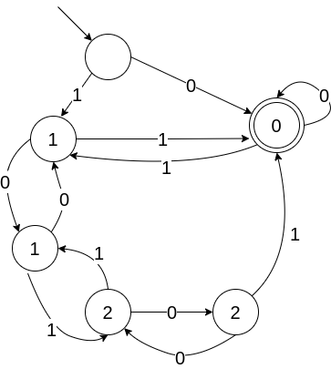

## Задание 1
Чтобы число в бинарном виде делилось на три необходимо чтобы разность количества единиц на четных местах и на нечетных делилась на три.  
  
Построим КНА. Посмотрим внимательно на возможные пути к терминальной вершине. Посмотрим на него внимательно. Мы можем соазу пойти в ноль либо пойти в единичку. Если пошли в ноль, все, дальше только повторять обход. Если пошли по единичке, то есть много путей, либо сразу пойти по единичке, либо пройти по нулю, ходит сколько то раз по единичке,сколько то раз пройти по нулю и все-равно по единице вернуться в терминальную. Тогда регулярка выглядит так:  
(1|1(01*0)\*1)\*
## Задание 2

## Задание 3
Строим для каждой регулярки автомат, а дальше должны проверить эквивалентность этих двух автоматов. Ходим dfs'ом паралельно по двум автоматам, смотрим, чтобы в один и тот же момент мы не находились в терминальной вершине.
## Задание 4
[Лексер](my_lexer.l)  
[Тест 1](test1.automat)  
[Тест 2](test2.automat)  
[Тест 3](test3.automat)  
