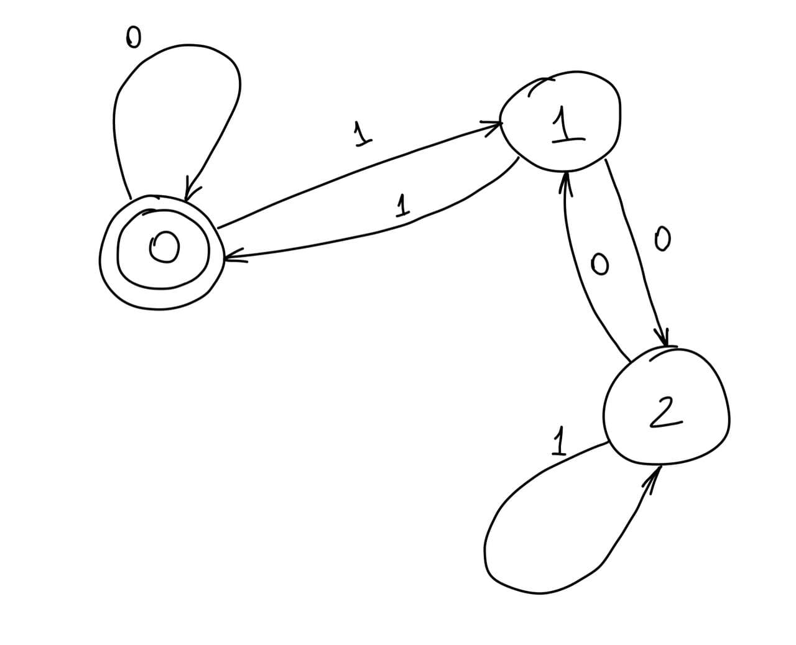

**Задание 1**

Ну, на самом деле, хочется сделать тот же самый трюк, что мы делали в случае чисел по основанию 10.

Сперва построим DFA. Далее по DFA построим регулярное выражение. Создадим 3 вершины, в которых будем хранить текущий остаток по модулю 3.

Ну и понятно, что надо сделать, чтобы получилось корректное регулярное выражение. Мы стартуем в состоянии, когда делимся на 3. 
Нам просто надо просто несколько раз в него вернуться. Сгенерировать регулярное выражение по DFA можно и вручную, но я нашёл классный сайт для этого. [Тык](http://ivanzuzak.info/noam/webapps/fsm2regex/)

Но можно и руками его сгенерировать.

``REGEXP = (0|1(01*0)*1)+``

Где `+` означает привычный `+` из регулярных выражений, которыми мы пользуемся на практике.

Его корректность очевидна: достаточно просто одновременно с его чтением смотреть на соответствующий DFA.

**Задание 2**

