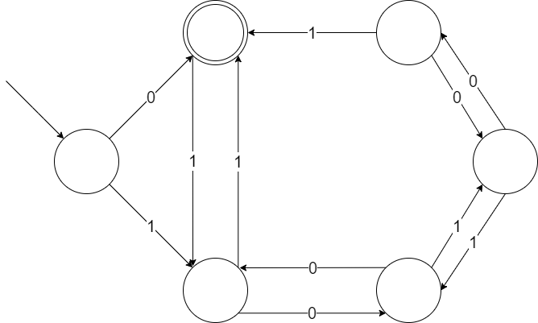
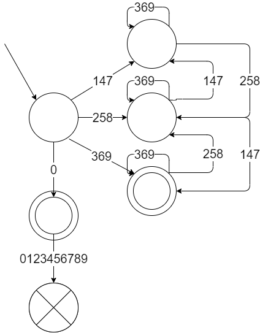
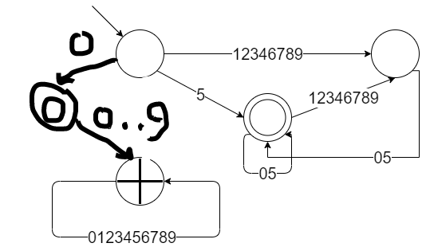
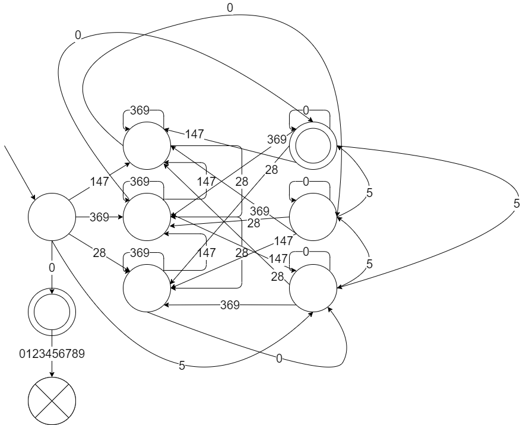

## Домашнее задание 2 (дедлайн 21.09 14:00)

1. (2 балла) Постройте регулярное выражение, распознающее числа в двоичной системе счисления, которые делятся на 3. Объясните, почему оно работает.
Чтобы число в двоичной системе счисления делилось на три, достаточно, чтобы количество единиц на четных позициях отличилось от количества на нечетных на число кртаное трем. Вот автомат: 

По данному автомату построим регулярное выражение (оно работает, потому что автомат работает):
```
(0|1(01*0)*1)*
```

2. (2 балла) Постройте детерминированный конечный автомат, распознающий числа в десятичной системе счисления, которые делятся на 15. Объясните, почему он работает.
Идея: построим автомат, который распознает числа кратные трем, и автомат, который распознает числа кратные пяти. Автомат для чисел кратных трем (нужно к трем вершинам добавить петлю 0):



Автомат для чисел кратных пяти:



Тогда автомат для чисел кратных 15:



3. (2 балл) Предложите алгоритм проверки двух регулярных выражений на эквивалентность.

Построим по каждой из регулярок автомат и проверим их (автоматы) на эквивалентность через минимизацию или же пустим параллельные bfs по двум автоматам, и если в какой-то момент в одном автомате мы находимся в терминальной вершине, а в другом -- нет, то автоматы не эквивалентны, в противном случае они эквивалентны.

4. (4 балла) Возьмите язык описания автоматов, который вы придумали в предыдущем задании, и напишите для него лексер, используя flex. 
    * Консольное приложение, ввод через stdin, вывод через stdout
    * На вход подаётся описание автомата в том формате, в котором вы его описали в прошлом ДЗ
    * Каждый токен нужно вывести отдельной строкой в следующем формате:

        `ТИП ЗНАЧЕНИЕ НОМЕР_СТРОКИ НОМЕР_СИМВОЛА`

        Например, для токена "идентификатор" вывод может выглядеть так:

        `T_ID abc 2 45`

    * Как узнать номер строки, обсуждали на паре (`yylineno`). А вот номер символа в строке придётся поддерживать вручную, подумайте, как это сделать.

    * Не забудьте про обработку ошибок. Вывод в случае ошибки тоже должен содержать локацию, где случилась ошибка.
    
    * Тесты обязательны (какие-то у вас должны остаться с прошлого ДЗ, их нужно дополнить).

    * Вам в помощь код с пары (лежит в той же ветке) и [мануал по flex](https://westes.github.io/flex/manual/index.html).
