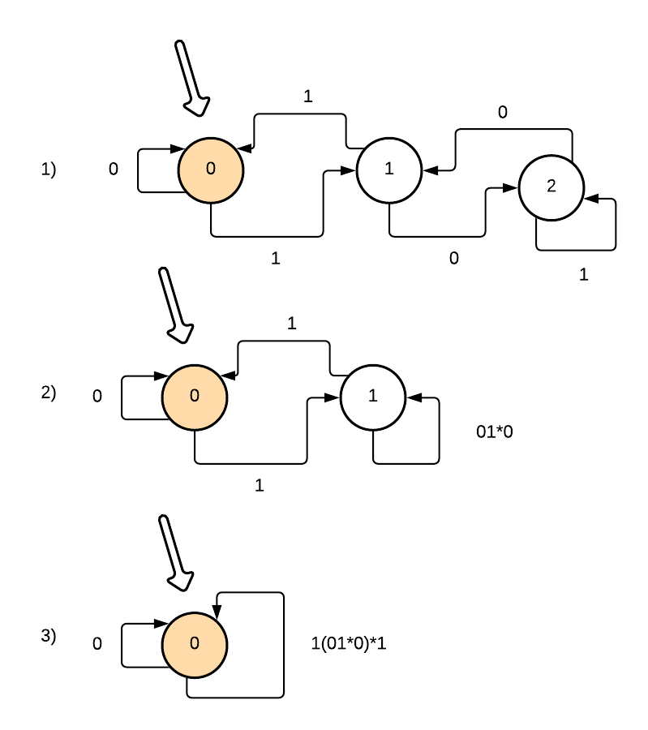
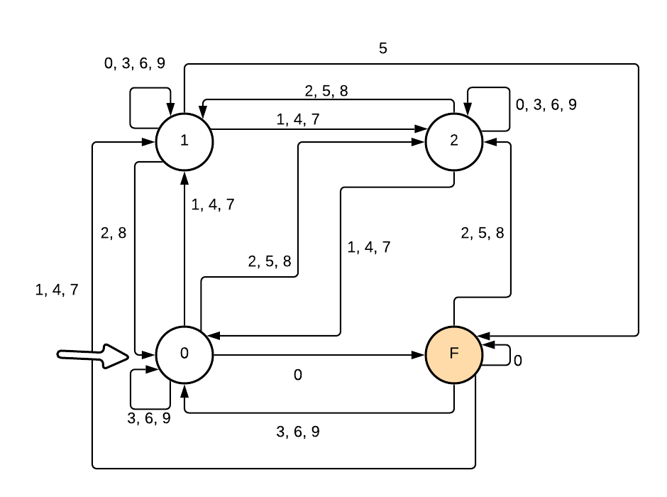

<b>
Наумцев Антон  
Домашняя работа  
Второй курс | Первый модуль  
Формальные языки # 2    
</b>
 
 
<h3>Задание 1:</h3>
Давайте построим детерминированный конечный автомат, в котором каждая вершина будет отображать текущий остаток при делении на 3, по которому будет строить регулярное выражение (рис. 1). Далее давайте "стягивать" вершины: сначала вершину с остатком 1 и 2, потом 0 и 1.

В итоге получим автомат, соответствующий рисунку 3, которому соответсвует регулярка: 

(0|1(01*0)*1)+ 
 

 

 
<h3>Задание 2:</h3>
Деление на 15 можно рассматривать как одновременное деление на 3 и на 5. Признак деления на 5 - простой: последняя цифра должна быть равна 0 или 5.
Давайте построим делимость на 3 и ещё добавим вершинку отвечающую за одновременную делимость на 3 и на 5 (она будет терминальной).
Любое число, делящееся на 15, можно записать в виде: 

$10x + y , \;\text{где} \; y \in \{0, 5\}$
Давайте рассмотрим два случая:

1\) $\;y = 0$, тогда чтобы число делилось на 15, x должен делиться на 3

2\) $\;y = 5$, в этом случае, чтобы число делилось на 15, x должен при делении на 3 давать остаток 1.

 

<h3>Задание 3:</h3>

1\) По регулярномым выражениям строим конечные детерминированные автоматы

2\) Минимизируем их

3\) Если в получившихся графах будет разное количество вершин, то данные регулярные выражения - разные

4\) Теперь давайте пронумеруем вершины в первом графе состояний и во втором

5\) Нам осталось проверить, что вершинам первого ДКА можно сопоставить перестановку вершин второго автомата, чтобы было соответствие рёбер.  Давайте сделаем это простым способом: переберём все перестановки вершин второго автомата и проверим, что есть хотя бы 1 перестановка, в которой сходятся все степени вершин и каждому ребру во втором автомате можно сопоставить ребро в первом.

<h3>Задание 4:</h3>
Немного изменил формат, так как изначально придуманный - очень сложно парсить

Сборка и запуск тестов произойдёт после комнды ./run.sh

Тесты лежат в tests, ответы на тесты появятся в testsout

Для запуска требуется утилиты: gcc и flex