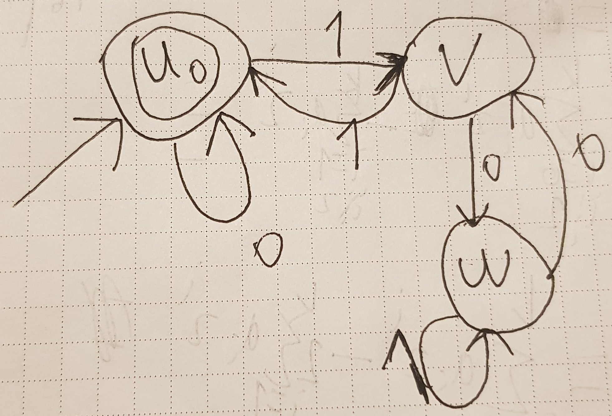
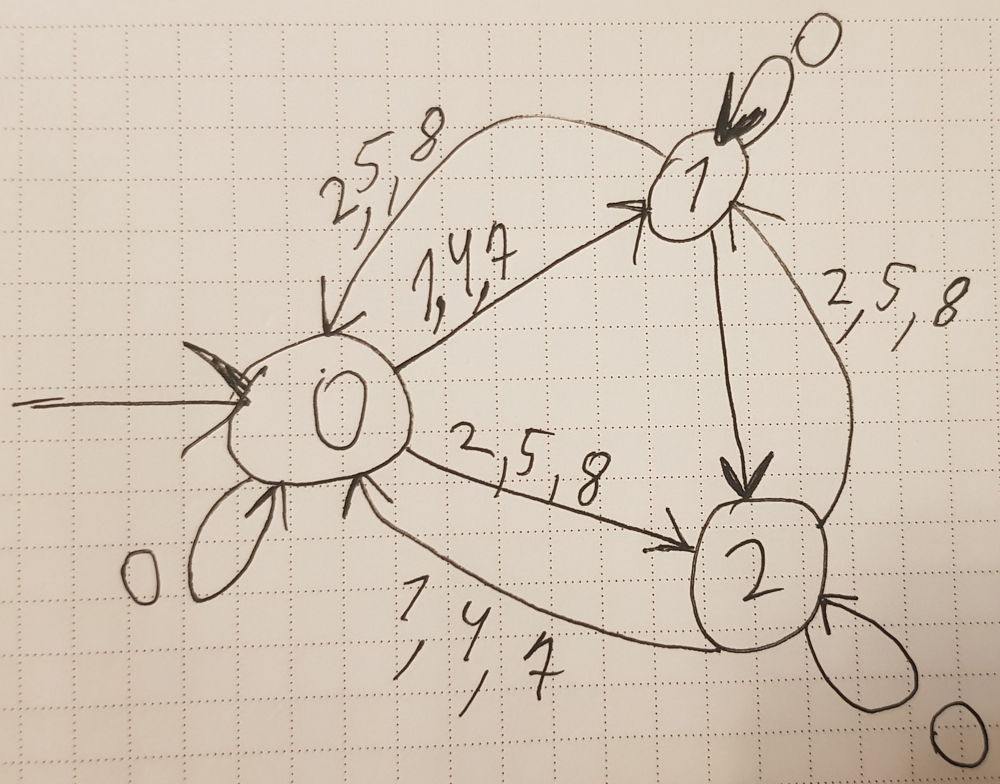
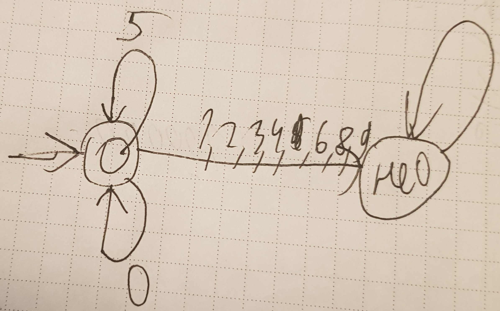
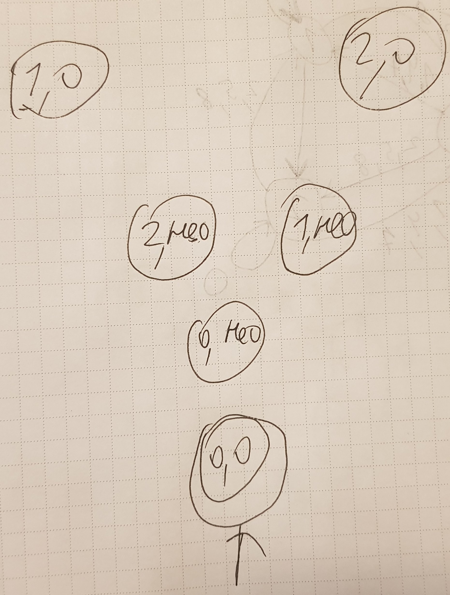

## Задача 1

Какой признак делимости на 3 двоичной системе счисления? Знакочередующаяся сумма цифр числа должна делиться на 3. Доказывается это точно так же, как доказывается признак делимости на 11 в десятичной системе счисления.

Тогда нетрудно построить автомат, распознающий делящиеся на 3 двоичные числа. Легко убедиться, что приведённый ниже автомат верен.

Ну и теперь, видя перед собой автомат, построить регулярку будет проще. Мы хотим, чтобы наша регулярка описывала слова, состоящие из либо проходов по петле из вершины u, либо уходов из u в вершину v с последующим возвратом. Первое это понятно просто `0`. А второе это `1(01*0)*1`. Итого имеем регулярное выражение `(0|1(01*0)*1)+` (`+` потому что у нас же обязательно число должно быть, а не пустая строка).

## Задача 2

Что нужно, чтобы проверить, что число делится на 15? Нужно проверить, делится ли оно и на 3, и на 5. Давайте построим эти два несложных автомата (признаки делимости на 3 и на 5), а затем построим произведение этих двух автоматов, по сути то же самое произведение графов игр из прошлого года.

Признак делимости на 3:

Признак делимости на 5:

И тогда в итоге получаем автомат на `2 * 3 = 6` состояниях (левое число пары — остаток от деления на 3 суммы цифр, правое число пары — остаток от деления на 5 последней цифры):

Ну короче очень сложно (в смысле долго и легко запутаться) перенести и все переходы в это произведение. Позвольте я лучше их строго опишу. В итоговом автомате мы пишем переход из `(a_1, a_2)` в `(b_1, b_2)` по символу `x` тогда и только тогда, когда в первом автомате есть переход `a_1 -> b_1` по символу `x` и во втором автомате есть переход `a_2 -> b_2` по символу `x`. Начальное и терминальное состояние у нас конечно же, как можете видеть, — это состояние, оба элемента пары которого были начальными и терминальными в исходных двух автоматах.

## Задача 3

На лекциях мы уже установили конструктивный способ сведения регулярных выражений к ДКА, а также способ минимизации ДКА. Давайте сведём обе наши регулярки к ДКА, а после чего оба из них минимизируем. Очевидно, что если в результате минимизации число состояний в автоматах станет различным, то эквивалентности нет. В ином же случае нам теперь нужно проверить изоморфность двух автоматов.

Сделать это можно, например, так. Пусть состояния первого автомата расположены в порядке 1 2 3 ... n, а состояния второго в некоторой перестановке `p_1 p_2 ... p_n`. Эта перестановка задаёт соответствие состояния `p_i` второго автомата i-му состоянию первого автомата. Будем перебирать все такие перестановки. Успех будет, если окажется, что у нас для какой-то перестановки, во-первых, совпали начальные и терминальные состояния и, во-вторых, совпали все переходы (для каждого перехода `u -> v` по символу `x` в первом автомате выполнено, что во втором автомате есть переход `p_u -> p_v` по символу `x`).
